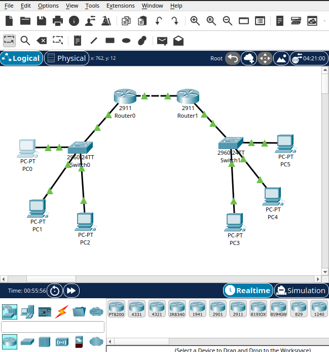
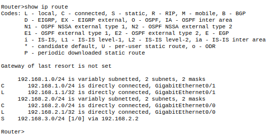
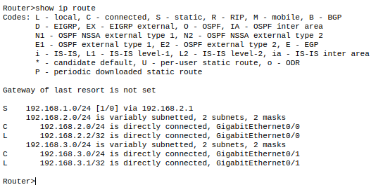

# Lab 02, Three Networks, Two Routers (Static Routing)

## Objective
Connect three separate networks through two routers, using a static route
so each router knows how to reach the network it is not directly connected
to.

## Topology


```
PC0, PC1, PC2 -- Switch0 -- G0/1 [Router0] G0/0 --- G0/0 [Router1] G0/1 -- Switch1 -- PC3, PC4, PC5
```

Three networks in total:

- Network A: `192.168.1.0/24`, connected to Router0 (PCs live here)
- Network B: `192.168.2.0/24`, the link between Router0 and Router1, no PCs
  here, just the two routers talking to each other
- Network C: `192.168.3.0/24`, connected to Router1 (PCs live here)

Router0 and Router1 are connected to each other using a crossover cable on
their Gigabit ports (same device type on both ends of that link).

## Configuration

- Router0
  - GigabitEthernet0/1: `192.168.1.1/24` (Network A)
  - GigabitEthernet0/0: `192.168.2.1/24` (Network B)
- Router1
  - GigabitEthernet0/0: `192.168.2.2/24` (Network B)
  - GigabitEthernet0/1: `192.168.3.1/24` (Network C)
- PC IP addresses assigned via DHCP pools configured on each router (not
  static this time, the focus of this lab was the routers, not the PCs).

### Static routes
On Router0, telling it how to reach Network C through Router1:
```
ip route 192.168.3.0 255.255.255.0 192.168.2.2
```

On Router1, telling it how to reach Network A through Router0:
```
ip route 192.168.1.0 255.255.255.0 192.168.2.1
```

## Problems found and how I fixed them
This lab took a lot more trial and error than Lab 01. Being honest about
what actually happened:

- **Duplicate IP addresses between interfaces.** At one point I assigned
  the same address to two different interfaces on the same router without
  noticing, the router flagged it with `%IP-4-DUPADDR: Duplicate address`.
  I had to go back into each interface with `show ip route` and recheck
  which address belonged where before reassigning them correctly.
- **Incomplete commands.** I ran `ip address` several times without the
  actual IP and mask after it, and got `% Incomplete command.` repeatedly.
  Simple mistake, just typing too fast and forgetting the rest of the line.
- **DHCP pool conflict.** Since I used DHCP for the PCs, I hit a
  `%DHCPD-4-PING_CONFLICT` warning where the router detected another device
  already answering on the address it was about to hand out. This happened
  because of the earlier duplicate IP issue on the interfaces, once that
  was fixed, the conflict stopped happening.
- **Forgetting the static route entirely at first.** The first ping attempt
  from PC0 to a PC on Network C failed with `Destination host unreachable`
  coming from my own gateway. That was the moment I realized the routers
  did not automatically know about networks they were not directly
  connected to, which is exactly why static routes exist. Running
  `show ip route` on each router before adding the route confirmed the
  missing network was not in the table at all.

None of these were routing logic mistakes, they were all typing or
configuration slip ups along the way. Once the interfaces had the correct,
non conflicting addresses and both static routes were in place, everything
worked.

## Result

Router0:


Router1:


Ping from PC0 to a PC on Network C:
```
C:\>ping 192.168.3.4

Pinging 192.168.3.4 with 32 bytes of data:

Request timed out.
Request timed out.
Reply from 192.168.3.4: bytes=32 time<1ms TTL=126
Reply from 192.168.3.4: bytes=32 time<1ms TTL=126

Ping statistics for 192.168.3.4:
Packets: Sent = 4, Received = 2, Lost = 2 (50% loss)
```

The first two packets timing out is expected here too, same ARP
resolution delay as in Lab 01, just with two router hops instead of one
this time. Once the path was resolved, replies came back clean. The TTL
of 126 (instead of 127 like in Lab 01) confirms the packet passed through
two routers instead of one, each hop decrements TTL by 1.

## What I learned
- A router only knows about networks it is directly connected to, unless
  you explicitly tell it about others.
- `ip route <destination network> <mask> <next hop>` is how you manually
  teach a router about a network that is not directly attached to it.
- `show ip route` is the fastest way to check what a router actually knows
  before assuming a routing problem is something more complex than it is.
- Most of the real difficulty in this lab was not the routing concept
  itself, it was careless typos and duplicate configuration. Slowing down
  and double checking each interface before moving to the next one would
  have saved a lot of back and forth.
- TTL decreasing by 1 per hop is a simple but useful way to confirm how
  many routers a packet actually passed through.

## Next step
Add a third router or a fourth network to practice static routes with more
than two hops, where a router needs a route to a network that is not
directly next to it either.
