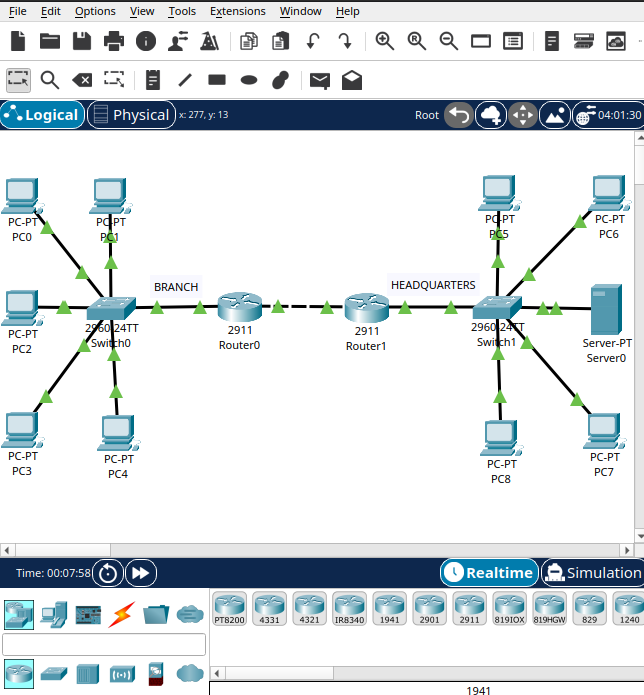
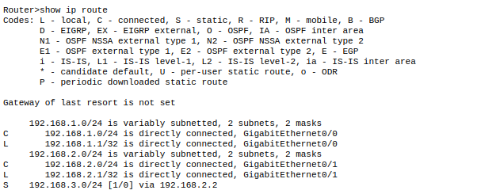
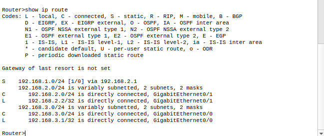
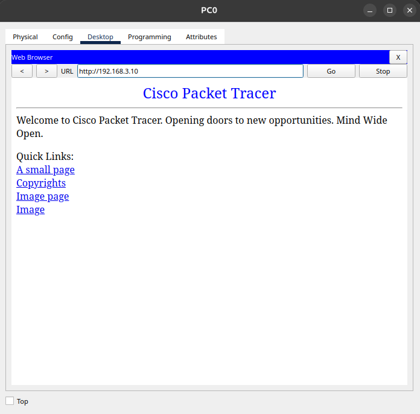

# Lab 03, Branch and Headquarters (Inter Site Communication)

## Objective
Simulate communication between two sites, a Branch office and a
Headquarters office, connected through two routers. The goal was to allow
PCs on the Branch network to reach a server located on the Headquarters
network.

## Topology


```
BRANCH                                          HEADQUARTERS

PC0, PC1, PC2, PC3, PC4                         PC5, PC6, PC7, PC8, Server0
        |                                                |
     Switch0                                          Switch1
        |                                                |
     Router0 ------------- link between routers ------ Router1
```

- Branch: 1 switch (Cisco 2960), 1 router (Cisco 2911), 5 PCs (PC0 to PC4)
- Headquarters: 1 switch (Cisco 2960), 1 router (Cisco 2911), 4 PCs (PC5 to PC8), 1 server
- Router0 and Router1 are connected directly to each other.

## Addressing table

| Network | Address | Gateway | Notes |
|---------|---------|---------|-------|
| Branch LAN | `192.168.1.0/24` | `192.168.1.1` (Router0, Gi0/0) | PCs get their address via DHCP |
| Link between routers | `192.168.2.0/24` | n/a | No hosts here, just Router0 (Gi0/1, `192.168.2.1`) and Router1 (Gi0/1, `192.168.2.2`) talking to each other |
| Headquarters LAN | `192.168.3.0/24` | `192.168.3.1` (Router1, Gi0/0) | PCs get their address via DHCP, Server0 has a static IP: `192.168.3.10` |

Note: since PC addressing comes from DHCP, individual PC addresses change
slightly every time the simulation is reopened. The network, gateway, and
server addresses above stay fixed.

## Configuration summary

- DHCP configured on Router0 for the Branch network.
- DHCP configured on Router1 for the Headquarters network.
- IP addressing configured on every router interface (LAN side and the
  link between the two routers).
- Default gateway assigned to each LAN, matching the router interface
  connected to it.
- Server0 connected to the Headquarters LAN.
- Static routes configured on both routers so each one knows how to reach
  the network on the other side.
- Connectivity tested with ping between Branch and Headquarters, and by
  accessing the server from a Branch PC.

### Static routes
On Router0, telling it how to reach the Headquarters network through
Router1:
```
ip route 192.168.3.0 255.255.255.0 192.168.2.2
```

On Router1, telling it how to reach the Branch network through Router0:
```
ip route 192.168.1.0 255.255.255.0 192.168.2.1
```

## Problem found and how I solved it
The main difficulty in this lab was not DHCP, that part went smoothly
since I had already configured it in previous labs. The real challenge was
understanding the `ip route` command properly, specifically the concept of
next hop.

At first I assumed the static route should point directly to the
destination network itself, as if I was just telling the router "this
network exists over there." Testing showed that was not enough. What
actually needs to go in the route is the IP address of the neighboring
router's interface on the network shared between the two routers, not the
final destination network.

In other words, a router does not send a packet straight to a distant
network it is not connected to. It sends the packet to the next device in
line, the neighbor it is directly connected to, and that neighbor decides
where to send it next. Understanding that a packet moves hop by hop
through directly connected interfaces, instead of jumping straight to its
final destination, was the main thing that clicked for me in this lab.

## Result

Router0's routing table, showing the static route to the Headquarters
network:


Router1's routing table, showing the static route to the Branch network:


A Branch PC (PC0) accessing the server's web page at Headquarters:


Ping from a Branch PC (PC0) to the server at `192.168.3.10`:
```
C:\>ping 192.168.3.10

Pinging 192.168.3.10 with 32 bytes of data:

Reply from 192.168.3.10: bytes=32 time<1ms TTL=126
Reply from 192.168.3.10: bytes=32 time<1ms TTL=126
Reply from 192.168.3.10: bytes=32 time<1ms TTL=126
Reply from 192.168.3.10: bytes=32 time<1ms TTL=126

Ping statistics for 192.168.3.10:
Packets: Sent = 4, Received = 4, Lost = 0 (0% loss)
```

TTL of 126 confirms the packet passed through two routers (Router0 and
Router1) to reach the server, one hop further than a single router setup.

- PCs on the Branch network can successfully ping devices on the
  Headquarters network.
- PCs on the Branch network can access the server located at
  Headquarters.
- Communication between the two sites is working as expected.

## What I learned
- A static route's next hop must be the address of a directly connected
  neighboring device, not the address of the final destination network.
- Data moves from router to router one hop at a time, each router only
  needs to know where to send a packet next, not the entire path.
- DHCP configuration across multiple LANs is straightforward once you
  understand how to do it for one network, it just repeats per site.
- This topology (Branch and Headquarters, connected through their own
  routers) is a simplified version of how real companies connect separate
  office locations.
