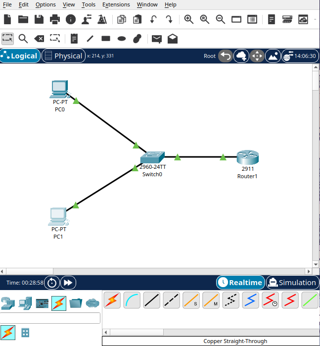

# Lab, VLANs with Router on a Stick

## Objective
Learn VLANs for the first time, dividing a single switch into two logical
networks (instead of using two separate physical switches like in earlier
labs), and connect them through one router using a single physical
interface split into subinterfaces (Router on a Stick).

## Topology


```
PC0 (VLAN 10)                              PC1 (VLAN 20)
      |                                          |
      +------------------ Switch0 ---------------+
                              |
                          (trunk link)
                              |
                          Router1
                    (Gi0/0.10 and Gi0/0.20,
                     subinterfaces on the same
                     physical port)
```

- 1 router (Cisco 2911), 1 switch (Cisco 2960), 2 PCs
- Both PCs connect to the same physical switch, but sit on different
  VLANs, not different switches like in previous labs
- The switch connects to the router through a single trunk link

## Addressing

| VLAN | Network | Mask | Gateway (router subinterface) | PC |
|------|---------|------|----------------------------------|-----|
| 10 (IT) | 192.168.1.0/28 | 255.255.255.240 | 192.168.1.1 (Gi0/0.10) | PC0, 192.168.1.10 |
| 20 (HR) | 192.168.1.16/28 | 255.255.255.240 | 192.168.1.17 (Gi0/0.20) | PC1, 192.168.1.20 |

## Configuration summary

### Switch
```
vlan 10
name IT
exit

vlan 20
name HR
exit

interface fastEthernet0/1
switchport mode access
switchport access vlan 10
exit

interface fastEthernet0/2
switchport mode access
switchport access vlan 20
exit
```

The port connecting to the router was set to trunk mode, so it could
carry traffic from both VLANs at once:
```
interface fastEthernet0/[trunk port]
switchport mode trunk
exit
```

Confirmed with `show vlan brief`:
```
VLAN Name                             Status    Ports
---- -------------------------------- --------- -------------------------------
1    default                          active    Fa0/3, Fa0/4, Fa0/5, Fa0/6
                                                Fa0/7, Fa0/8, Fa0/9, Fa0/10
                                                Fa0/11, Fa0/12, Fa0/13, Fa0/14
                                                Fa0/15, Fa0/16, Fa0/17, Fa0/18
                                                Fa0/19, Fa0/20, Fa0/21, Fa0/22
                                                Fa0/23, Fa0/24, Gig0/1, Gig0/2
10   IT                               active    Fa0/1
20   HR                               active    Fa0/2
```

### Router (subinterfaces)
```
interface GigabitEthernet0/0.10
encapsulation dot1Q 10
ip address 192.168.1.1 255.255.255.240
exit

interface GigabitEthernet0/0.20
encapsulation dot1Q 20
ip address 192.168.1.17 255.255.255.240
exit

interface GigabitEthernet0/0
no shutdown
exit
```

The physical interface (`GigabitEthernet0/0`) has no IP address of its
own, only the subinterfaces do. Confirmed with `show ip interface brief`:
```
Interface              IP-Address      OK? Method Status                Protocol
GigabitEthernet0/0     unassigned      YES manual up                    up
GigabitEthernet0/0.10  192.168.1.1     YES manual up                    up
GigabitEthernet0/0.20  192.168.1.17    YES manual up                    up
```

### PCs
Static IP addressing:
- PC0: `192.168.1.10`, mask `255.255.255.240`, gateway `192.168.1.1`
- PC1: `192.168.1.20`, mask `255.255.255.240`, gateway `192.168.1.17`

## Problems and troubleshooting
This lab had more small mistakes along the way than previous ones, all
worth keeping in the documentation since they were part of learning VLAN
syntax for the first time.

- **Missing space in a command.** Typed `vlan10` instead of `vlan 10`,
  the switch rejected it as invalid input. Fixed by adding the space.
- **Typo in `access`.** Typed `switchport mode acess` (missing a "s"),
  rejected, fixed on the next line.
- **Incomplete keyword.** Typed `switch access vlan 20` instead of
  `switchport access vlan 20`, missing the full word `switchport`, also
  rejected and corrected.
- **`show vlan brief` run from the wrong mode.** Tried running it while
  still inside global configuration mode, which is not valid there, had
  to `exit` back to privileged mode first.
- **Typo in `ip address`.** Wrote `ip adress` (missing a "d") while
  configuring a subinterface, rejected, corrected immediately.
- **Confusion about IP on the physical interface.** Before fully
  understanding Router on a Stick, I tried assigning an IP address
  directly to `GigabitEthernet0/0` (the physical interface, without a
  subinterface). That is not how this setup works, the physical interface
  should stay without its own IP, only the subinterfaces (`.10` and
  `.20`) get addressed. I removed it with `no ip address` once I
  understood this.
- **No router in the topology at first.** I initially tested the two PCs
  connected only through the switch, with no router at all, just to see
  what would happen. The ping failed, PC0 and PC1 on different VLANs are
  completely isolated from each other without something to route between
  them. That confirmed VLAN isolation was working correctly, and made it
  clear why the router step was necessary.
- **Ping failing even with everything else configured.** After trunk,
  VLANs, and subinterfaces were all set up, the ping between PC0 and PC1
  still failed with 100% loss. The actual cause was much simpler than
  expected, both PCs still had `0.0.0.0` as their Default Gateway, never
  configured. Once the correct gateway was set on each PC (`192.168.1.1`
  on PC0, `192.168.1.17` on PC1), the ping succeeded.

## Result
Ping from PC0 to PC1 (192.168.1.20):
```
C:\>ping 192.168.1.20

Pinging 192.168.1.20 with 32 bytes of data:

Request timed out.
Reply from 192.168.1.20: bytes=32 time<1ms TTL=127
Reply from 192.168.1.20: bytes=32 time<1ms TTL=127
Reply from 192.168.1.20: bytes=32 time<1ms TTL=127

Ping statistics for 192.168.1.20:
Packets: Sent = 4, Received = 3, Lost = 1 (25% loss)
```

Ping from PC1 to PC0 (192.168.1.10):
```
C:\>ping 192.168.1.10

Pinging 192.168.1.10 with 32 bytes of data:

Reply from 192.168.1.10: bytes=32 time=25ms TTL=127
Reply from 192.168.1.10: bytes=32 time<1ms TTL=127
Reply from 192.168.1.10: bytes=32 time<1ms TTL=127
Reply from 192.168.1.10: bytes=32 time<1ms TTL=127

Ping statistics for 192.168.1.10:
Packets: Sent = 4, Received = 4, Lost = 0 (0% loss)
```

TTL of 127 confirms the packet passed through exactly one router, the
same router handling both VLANs through its subinterfaces. The single
timeout on the first ping is consistent with the usual ARP resolution
delay seen on a first attempt in previous labs.

## What I learned
- A VLAN divides a single physical switch into separate logical networks,
  as an alternative to using multiple physical switches. Two devices on
  different VLANs, connected to the very same switch, cannot reach each
  other without something routing between the VLANs, exactly the same
  isolation that separate physical networks have.
- A trunk port carries traffic from multiple VLANs over a single physical
  link, tagging each frame so the receiving end knows which VLAN it
  belongs to.
- Router on a Stick lets one physical router interface serve multiple
  VLANs by splitting it into subinterfaces, each with its own
  `encapsulation dot1Q` tag and its own IP address.
- The physical interface used for subinterfaces should not have its own
  IP address, the subinterfaces carry the addressing, the physical
  interface just needs to be up.
- No matter how correct the VLAN, trunk, and subinterface configuration
  is, none of it matters if the PCs do not have the right default
  gateway. That single missing setting was the actual reason
  connectivity failed even after everything else was right.
- Testing the failure case on purpose (pinging between VLANs with no
  router present) was a useful way to confirm VLAN isolation was actually
  working before adding the router into the picture.
