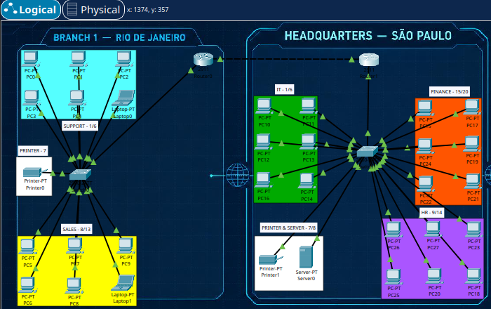

# TechNova Solutions, Corporate Network

## Overview

TechNova Solutions is a hands-on Cisco Packet Tracer corporate network project built to practice VLAN segmentation, inter-VLAN routing, DHCP, DNS, network printers, and static routing between two locations.

The network connects a **Rio de Janeiro branch** to the **São Paulo headquarters** through two routers.

The project was built from the requirements rather than from a predefined addressing plan. Network addressing, VLAN IDs, device configuration, and routing were configured during implementation and then verified through troubleshooting and connectivity tests.

---

## Objective

The main objectives of this project were to:

- Build a segmented corporate network using VLANs.
- Separate departments and network services into different logical networks.
- Configure access ports and trunk links.
- Implement Router on a Stick for inter-VLAN routing.
- Configure DHCP for the VLANs.
- Deploy a DNS server at the São Paulo headquarters.
- Configure a dedicated network printer VLAN.
- Connect Rio de Janeiro and São Paulo through a router-to-router link.
- Configure static routes between the two locations.
- Verify end-to-end connectivity between VLANs and locations.
- Document configuration errors and the troubleshooting process.

---

## Network Topology



The topology is divided into two locations:

```text
                    TECHNOVA SOLUTIONS

        RIO DE JANEIRO                 SÃO PAULO
             BRANCH                  HEADQUARTERS

        ┌──────────────┐             ┌──────────────┐
        │   Switch 0   │             │   Switch 1   │
        └──────┬───────┘             └──────┬───────┘
               │                            │
          End Devices                  End Devices
               │                            │
          Router 0 ─────────────────── Router 1
                   192.168.2.0/28
```

The router-to-router connection uses the `192.168.2.0/28` transit network.

```text
Router 0                         Router 1
192.168.2.1  ──────────────────  192.168.2.2
```

---

# Company Structure

## Rio de Janeiro — Branch

| VLAN | Department / Purpose |
|---:|---|
| 10 | Support |
| 15 | Printer |
| 20 | Sales |

The Rio de Janeiro switch uses access ports to place end devices into their respective VLANs.

## São Paulo — Headquarters

The São Paulo headquarters uses four VLANs:

| VLAN | Network |
|---:|---|
| 30 | `192.168.3.0/28` |
| 35 | `192.168.3.16/28` |
| 40 | `192.168.3.32/28` |
| 50 | `192.168.3.48/28` |

---

# IP Addressing

## Rio de Janeiro

| VLAN | Network | Gateway |
|---:|---|---|
| 10 | `192.168.1.0/28` | `192.168.1.1` |
| 15 | `192.168.1.16/28` | `192.168.1.17` |
| 20 | `192.168.1.32/28` | `192.168.1.33` |

## Router-to-Router Link

| Device | Interface | Address |
|---|---|---|
| Router 0 | Gi0/1 | `192.168.2.1/28` |
| Router 1 | Gi0/1 | `192.168.2.2/28` |

## São Paulo

| VLAN | Network | Gateway |
|---:|---|---|
| 30 | `192.168.3.0/28` | `192.168.3.1` |
| 35 | `192.168.3.16/28` | `192.168.3.17` |
| 40 | `192.168.3.32/28` | `192.168.3.33` |
| 50 | `192.168.3.48/28` | `192.168.3.49` |

---

# VLAN Configuration

VLANs were created to logically separate departments and network services.

Example from the Rio de Janeiro switch:

```cisco
vlan 10
name SUPPORT
exit

vlan 15
name PRINTER
exit

vlan 20
name SALES
exit
```

The VLAN assignments were verified with:

```cisco
show vlan brief
```

The switch showed the expected access ports assigned to VLANs 10, 15, and 20.

---

# Access Ports

End devices were connected through access ports because each access port belongs to a single VLAN.

Example:

```cisco
interface range fastEthernet0/1-6
switchport mode access
switchport access vlan 10
exit
```

Printer:

```cisco
interface fastEthernet0/7
switchport mode access
switchport access vlan 15
exit
```

Sales:

```cisco
interface range fastEthernet0/8-13
switchport mode access
switchport access vlan 20
exit
```

This allows multiple logical networks to coexist on the same physical switch.

---

# Trunk Configuration

The switch-to-router connection was configured as a trunk:

```cisco
interface gigabitEthernet0/1
switchport mode trunk
exit
```

The trunk carries traffic belonging to multiple VLANs through the same physical link.

---

# Router on a Stick

Router 0 uses multiple subinterfaces on the same physical interface.

### VLAN 10

```cisco
interface GigabitEthernet0/0.10
encapsulation dot1q 10
ip address 192.168.1.1 255.255.255.240
exit
```

### VLAN 15

```cisco
interface GigabitEthernet0/0.15
encapsulation dot1q 15
ip address 192.168.1.17 255.255.255.240
exit
```

### VLAN 20

```cisco
interface GigabitEthernet0/0.20
encapsulation dot1q 20
ip address 192.168.1.33 255.255.255.240
exit
```

Router 1 follows the same Router-on-a-Stick concept for VLANs 30, 35, 40, and 50.

The physical interface carries the VLAN traffic while the subinterfaces provide the individual Layer 3 gateways.

---

# 802.1Q Encapsulation

The `encapsulation dot1q` command associates a router subinterface with a VLAN ID.

For example:

```cisco
encapsulation dot1q 20
```

means that the subinterface handles traffic tagged for VLAN 20.

One of the troubleshooting problems in this project occurred when the VLAN 20 subinterface was missing its 802.1Q encapsulation. The IP address configuration was rejected until the encapsulation was configured.

This helped demonstrate that Router on a Stick depends on the VLAN tag to determine which logical network a packet belongs to.

---

# DHCP

DHCP was configured for the VLANs so that end devices could automatically receive network configuration.

The DHCP service provides:

- IP address
- Subnet mask
- Default gateway
- DNS server information

All PCs successfully received IP addresses through DHCP after the configuration was completed.

A typo was encountered during DHCP configuration and corrected during troubleshooting.

---

# DNS Server

A DNS server was deployed at the São Paulo headquarters.

The configured DNS server address is:

```text
192.168.3.19
```

The server provides centralized DNS functionality and is reachable from the network locations after the routing configuration was completed.

---

# Network Printer

A dedicated printer VLAN was created in Rio de Janeiro:

```text
VLAN 15
Network: 192.168.1.16/28
Gateway: 192.168.1.17
```

The printer is connected to an access port assigned specifically to VLAN 15.

This demonstrates how infrastructure devices can also be separated into their own logical network.

---

# Static Routing

The two locations communicate through the `192.168.2.0/28` transit network.

```text
Rio de Janeiro                         São Paulo
Router 0                               Router 1
192.168.2.1 ───────────────────────── 192.168.2.2
```

Static routes were configured on both routers so each side could reach the remote VLAN networks.

## Router 0 — Rio de Janeiro

The São Paulo networks are reached through Router 1:

```cisco
ip route 192.168.3.0 255.255.255.240 192.168.2.2
ip route 192.168.3.16 255.255.255.240 192.168.2.2
ip route 192.168.3.32 255.255.255.240 192.168.2.2
ip route 192.168.3.48 255.255.255.240 192.168.2.2
```

## Router 1 — São Paulo

The Rio de Janeiro networks are reached through Router 0:

```cisco
ip route 192.168.1.0 255.255.255.240 192.168.2.1
ip route 192.168.1.16 255.255.255.240 192.168.2.1
ip route 192.168.1.32 255.255.255.240 192.168.2.1
```

The routing tables were verified with:

```cisco
show ip route
```

Static routes appeared with the `S` designation.

---

# Troubleshooting

This project was not built without errors. Several configuration mistakes occurred during implementation and were corrected while troubleshooting.

## Incorrect VLAN Command

A VLAN command was initially entered without the required space:

```text
vlan10
```

The switch rejected the command.

It was corrected to:

```text
vlan 10
```

## Typo in Access Mode

The following command contained a typo:

```text
switchport mode acess
```

It was corrected to:

```text
switchport mode access
```

## Incomplete Switchport Command

Another configuration attempt used:

```text
switch access vlan 20
```

The correct command is:

```text
switchport access vlan 20
```

## Missing 802.1Q Encapsulation

The VLAN 20 router subinterface initially did not have:

```cisco
encapsulation dot1q 20
```

The router rejected the subsequent IP configuration.

After adding the encapsulation, the subinterface could be configured correctly.

## Incorrect DHCP Command

A DHCP command was initially entered with a typo:

```text
ip dchp pool VLAN20
```

The command was corrected to the proper DHCP syntax.

## Incorrect Static Route Next Hop

A route was initially configured using the local router's own IP as the next hop.

The router returned:

```text
%Invalid next hop address (it's this router)
```

The route was corrected to use the neighboring router:

```cisco
ip route 192.168.3.0 255.255.255.240 192.168.2.2
```

This reinforced the difference between a router's own address and the address of the next-hop router.

---

# Verification

The following Cisco IOS commands were used during the implementation:

```cisco
show vlan brief
```

Used to verify VLAN creation and port assignments.

```cisco
show ip interface brief
```

Used to verify router interfaces and subinterfaces.

```cisco
show ip route
```

Used to verify connected networks and static routes.

Connectivity was also tested from the PCs using ICMP ping.

The final network was successfully verified:

- PCs received IP addresses through DHCP.
- Devices communicated within their networks.
- Inter-VLAN communication worked through Router on a Stick.
- The Rio de Janeiro branch communicated with the São Paulo headquarters.
- Remote VLAN networks were reachable through the static routes.
- The DNS server was reachable.
- The network printer was connected to its dedicated VLAN.

Individual ping outputs were not retained in the project documentation, so no specific packet-loss or latency values are claimed here.

---

# Final Architecture

```text
                         TECHNOVA SOLUTIONS

                    ┌────────────────────────┐
                    │     RIO DE JANEIRO     │
                    │         BRANCH         │
                    │                        │
                    │ VLAN 10 — SUPPORT      │
                    │ VLAN 15 — PRINTER      │
                    │ VLAN 20 — SALES        │
                    │                        │
                    │        Switch          │
                    │           │            │
                    │        Router 0        │
                    └───────────┬────────────┘
                                │
                         192.168.2.0/28
                                │
                    ┌───────────┴────────────┐
                    │        Router 1        │
                    │           │            │
                    │         Switch         │
                    │                        │
                    │ VLAN 30                │
                    │ VLAN 35                │
                    │ VLAN 40                │
                    │ VLAN 50                │
                    │                        │
                    │ DNS — 192.168.3.19     │
                    │                        │
                    │      SÃO PAULO         │
                    │     HEADQUARTERS       │
                    └────────────────────────┘
```

---

# What I Learned

This project brought together several networking concepts that had previously been practiced separately.

I learned how VLAN segmentation can separate departments and services while still using the same physical switching infrastructure.

I also gained a better understanding of the relationship between:

- Access ports
- Trunk ports
- VLAN IDs
- 802.1Q tagging
- Router subinterfaces
- Inter-VLAN routing

The troubleshooting process made Router on a Stick much clearer because the VLAN tag was no longer just a command to memorize. It became part of understanding how the router identifies traffic belonging to each logical network.

Static routing also required understanding that every router must have a path to the remote networks and that the next hop must be the neighboring router.

The project reinforced the importance of verification commands such as:

```cisco
show vlan brief
show ip interface brief
show ip route
```

Rather than assuming that a configuration worked, these commands provided direct evidence of what the devices knew about the network.

---

# Final Result

The TechNova Solutions corporate network was successfully implemented in Cisco Packet Tracer.

The final network provides:

- VLAN-based segmentation
- Access and trunk port configuration
- Router on a Stick
- 802.1Q encapsulation
- Inter-VLAN routing
- DHCP
- DNS
- Network printer connectivity
- Static routing
- Communication between Rio de Janeiro and São Paulo
- End-to-end connectivity testing
- Practical Cisco IOS troubleshooting

The project represents the transition from isolated networking exercises toward a larger multi-site network architecture built from requirements and tested through hands-on implementation.

---

## Technologies & Concepts

```text
Cisco Packet Tracer
Cisco IOS
IPv4
Subnetting
VLAN
802.1Q
Access Ports
Trunk Ports
Router on a Stick
Inter-VLAN Routing
Static Routing
DHCP
DNS
ICMP
Network Printers
Network Troubleshooting
```
