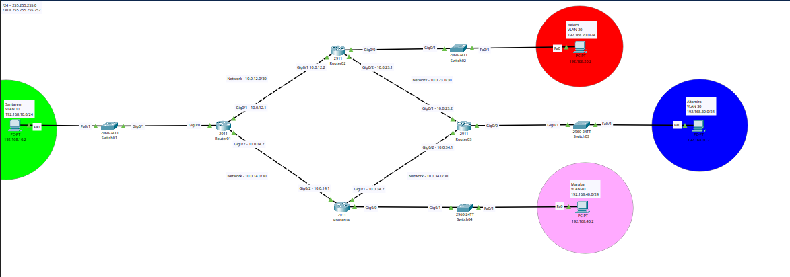
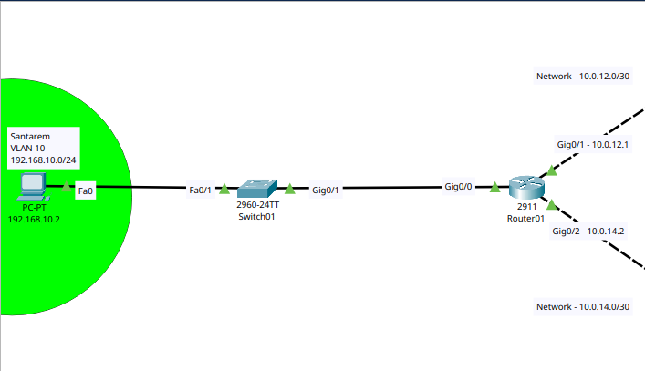
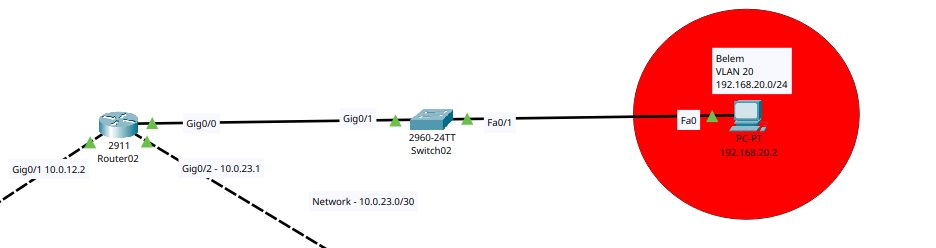
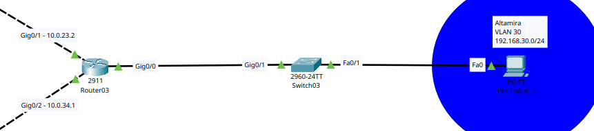
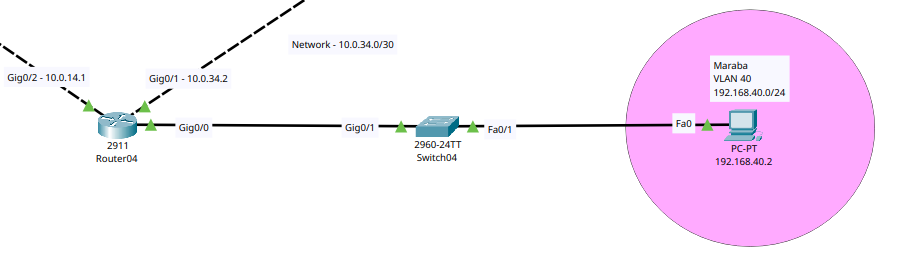

# Lab 08: OSPF Single Area Network Across 4 Simulated Cities

## Overview

This lab simulates a small company with offices in four different cities in the state of Pará, Brazil: Santarem, Belem, Altamira and Maraba. Each city has its own router, switch, VLAN and a PC representing the local user network. All four routers are connected in a ring topology and exchange routing information using OSPF (single area, Area 0).

The goal of this lab was to practice:

- VLAN creation and trunking on Cisco switches
- Router on a Stick (subinterfaces with dot1Q encapsulation)
- DHCP pool configuration per site
- OSPF configuration, including `passive-interface` on LAN facing subinterfaces
- Verifying OSPF neighbor adjacency and the routing table
- End to end connectivity testing and troubleshooting

## Topology

The four routers form a ring, so every router has exactly two OSPF neighbors and there are two possible paths between any two cities.



Below are close up views of each site.

### Santarem (Router01)



### Belem (Router02)



### Altamira (Router03)



### Maraba (Router04)



## IP Addressing Table

### LAN networks (VLANs)

| City     | VLAN | Network          | Gateway         |
|----------|------|------------------|------------------|
| Santarem | 10   | 192.168.10.0/24  | 192.168.10.1     |
| Belem    | 20   | 192.168.20.0/24  | 192.168.20.1     |
| Altamira | 30   | 192.168.30.0/24  | 192.168.30.1     |
| Maraba   | 40   | 192.168.40.0/24  | 192.168.40.1     |

### Point to point links between routers (/30)

| Link         | Network         | Router A            | Router B            |
|--------------|-----------------|----------------------|----------------------|
| R1 to R2     | 10.0.12.0/30    | Router01 Gi0/1 .1    | Router02 Gi0/1 .2    |
| R2 to R3     | 10.0.23.0/30    | Router02 Gi0/2 .1    | Router03 Gi0/1 .2    |
| R3 to R4     | 10.0.34.0/30    | Router03 Gi0/2 .1    | Router04 Gi0/1 .2    |
| R1 to R4     | 10.0.14.0/30    | Router04 Gi0/2 .1    | Router01 Gi0/2 .2    |

### PC addressing

| PC              | IP Address     | Default Gateway  |
|-----------------|----------------|-------------------|
| PC Santarem     | 192.168.10.2   | 192.168.10.1      |
| PC Belem        | 192.168.20.2   | 192.168.20.1      |
| PC Altamira     | 192.168.30.2   | 192.168.30.1      |
| PC Maraba       | 192.168.40.2   | 192.168.40.1      |

## Device Configuration

All switches used are Cisco 2960-24TT and all routers are Cisco 2911. The pattern repeated at every site is the same: create the VLAN on the switch, set the port facing the router as trunk, set the port facing the PC as access, then on the router configure the main interface, the dot1Q subinterface for the VLAN, and a DHCP pool for that VLAN.

### Switch01, Santarem

```
Switch(config)# vlan 10
Switch(config-vlan)# name SANTAREM
Switch(config-vlan)# exit
Switch(config)# interface gigabitEthernet 0/1
Switch(config-if)# switchport mode trunk
Switch(config-if)# exit
Switch(config)# interface fastEthernet 0/1
Switch(config-if)# switchport mode access
Switch(config-if)# switchport access vlan 10
Switch(config-if)# exit
```

### Router01, Santarem

```
Router> enable
Router# configure terminal
Router(config)# interface gigabitEthernet 0/0
Router(config-if)# no shutdown
Router(config-if)# exit
Router(config)# interface gigabitEthernet 0/0.10
Router(config-subif)# encapsulation dot1Q 10
Router(config-subif)# ip address 192.168.10.1 255.255.255.0
Router(config-subif)# exit
Router(config)# interface gigabitEthernet 0/1
Router(config-if)# ip address 10.0.12.1 255.255.255.252
Router(config-if)# no shutdown
Router(config-if)# exit
Router(config)# interface gigabitEthernet 0/2
Router(config-if)# ip address 10.0.14.2 255.255.255.252
Router(config-if)# no shutdown
Router(config-if)# exit
Router(config)# ip dhcp excluded-address 192.168.10.1
Router(config)# ip dhcp pool POOL_SANTAREM
Router(dhcp-config)# network 192.168.10.0 255.255.255.0
Router(dhcp-config)# default-router 192.168.10.1
Router(dhcp-config)# exit
```

### Switch02, Belem

```
Switch> enable
Switch# configure terminal
Switch(config)# vlan 20
Switch(config-vlan)# name BELEM
Switch(config-vlan)# exit
Switch(config)# interface gigabitEthernet 0/1
Switch(config-if)# switchport mode trunk
Switch(config-if)# exit
Switch(config)# interface fastEthernet 0/1
Switch(config-if)# switchport mode access
Switch(config-if)# switchport access vlan 20
Switch(config-if)# exit
```

### Router02, Belem

```
Router> enable
Router# configure terminal
Router(config)# interface gigabitEthernet 0/0
Router(config-if)# no shutdown
Router(config-if)# exit
Router(config)# interface gigabitEthernet 0/0.20
Router(config-subif)# encapsulation dot1Q 20
Router(config-subif)# ip address 192.168.20.1 255.255.255.0
Router(config-subif)# exit
Router(config)# ip dhcp excluded-address 192.168.20.1
Router(config)# ip dhcp pool POOL_BELEM
Router(dhcp-config)# network 192.168.20.0 255.255.255.0
Router(dhcp-config)# default-router 192.168.20.1
Router(dhcp-config)# exit
Router(config)# interface gigabitEthernet 0/1
Router(config-if)# ip address 10.0.12.2 255.255.255.252
Router(config-if)# no shutdown
Router(config-if)# exit
Router(config)# interface gigabitEthernet 0/2
Router(config-if)# ip address 10.0.23.1 255.255.255.252
Router(config-if)# no shutdown
Router(config-if)# exit
```

### Switch03, Altamira

```
Switch> enable
Switch# configure terminal
Switch(config)# interface gigabitEthernet 0/1
Switch(config-if)# switchport mode trunk
Switch(config-if)# exit
Switch(config)# vlan 30
Switch(config-vlan)# name ALTAMIRA
Switch(config-vlan)# exit
Switch(config)# interface fastEthernet 0/1
Switch(config-if)# switchport mode access
Switch(config-if)# switchport access vlan 30
Switch(config-if)# exit
```

### Router03, Altamira

```
Router> enable
Router# configure terminal
Router(config)# interface gigabitEthernet 0/0
Router(config-if)# no shutdown
Router(config-if)# exit
Router(config)# interface gigabitEthernet 0/0.30
Router(config-subif)# encapsulation dot1Q 30
Router(config-subif)# ip address 192.168.30.1 255.255.255.0
Router(config-subif)# exit
Router(config)# ip dhcp excluded-address 192.168.30.1
Router(config)# ip dhcp pool POOL_ALTAMIRA
Router(dhcp-config)# network 192.168.30.0 255.255.255.0
Router(dhcp-config)# default-router 192.168.30.1
Router(dhcp-config)# exit
Router(config)# interface gigabitEthernet 0/1
Router(config-if)# ip address 10.0.23.2 255.255.255.252
Router(config-if)# no shutdown
Router(config-if)# exit
Router(config)# interface gigabitEthernet 0/2
Router(config-if)# ip address 10.0.34.1 255.255.255.252
Router(config-if)# no shutdown
Router(config-if)# exit
```

### Switch04, Maraba

```
Switch> enable
Switch# configure terminal
Switch(config)# vlan 40
Switch(config-vlan)# name MARABA
Switch(config-vlan)# exit
Switch(config)# interface gigabitEthernet 0/1
Switch(config-if)# switchport mode trunk
Switch(config-if)# exit
Switch(config)# interface fastEthernet 0/1
Switch(config-if)# switchport mode access
Switch(config-if)# switchport access vlan 40
Switch(config-if)# exit
```

### Router04, Maraba

```
Router> enable
Router# configure terminal
Router(config)# interface gigabitEthernet 0/0
Router(config-if)# no shutdown
Router(config-if)# exit
Router(config)# interface gigabitEthernet 0/0.40
Router(config-subif)# encapsulation dot1Q 40
Router(config-subif)# ip address 192.168.40.1 255.255.255.0
Router(config-subif)# exit
Router(config)# ip dhcp excluded-address 192.168.40.1
Router(config)# ip dhcp pool POOL_MARABA
Router(dhcp-config)# network 192.168.40.0 255.255.255.0
Router(dhcp-config)# default-router 192.168.40.1
Router(dhcp-config)# exit
Router(config)# interface gigabitEthernet 0/1
Router(config-if)# ip address 10.0.34.2 255.255.255.252
Router(config-if)# no shutdown
Router(config-if)# exit
Router(config)# interface gigabitEthernet 0/2
Router(config-if)# ip address 10.0.14.1 255.255.255.252
Router(config-if)# no shutdown
Router(config-if)# exit
```

## OSPF Configuration

OSPF process 1 was used on every router, all in Area 0. Each router advertises its local VLAN network and the two point to point links that connect it to its neighbors in the ring. The `passive-interface` command was applied on the LAN facing subinterface of each router, since there are only end user PCs there and no other OSPF speaking device, so there is no reason to send Hello packets out of that interface. The network itself is still advertised normally, only the Hello packets are suppressed.

### Router01, Santarem

```
Router(config)# router ospf 1
Router(config-router)# router-id 1.1.1.1
Router(config-router)# network 192.168.10.0 0.0.0.255 area 0
Router(config-router)# network 10.0.12.0 0.0.0.3 area 0
Router(config-router)# network 10.0.14.0 0.0.0.3 area 0
Router(config-router)# passive-interface gigabitEthernet0/0.10
```

### Router02, Belem

```
Router(config)# router ospf 1
Router(config-router)# router-id 2.2.2.2
Router(config-router)# network 192.168.20.0 0.0.0.255 area 0
Router(config-router)# network 10.0.12.0 0.0.0.3 area 0
Router(config-router)# network 10.0.23.0 0.0.0.3 area 0
Router(config-router)# passive-interface gigabitEthernet0/0.20
```

### Router03, Altamira

```
Router(config)# router ospf 1
Router(config-router)# router-id 3.3.3.3
Router(config-router)# network 192.168.30.0 0.0.0.255 area 0
Router(config-router)# network 10.0.23.0 0.0.0.3 area 0
Router(config-router)# network 10.0.34.0 0.0.0.3 area 0
Router(config-router)# passive-interface gigabitEthernet0/0.30
```

### Router04, Maraba

```
Router(config)# router ospf 1
Router(config-router)# router-id 4.4.4.4
Router(config-router)# network 192.168.40.0 0.0.0.255 area 0
Router(config-router)# network 10.0.34.0 0.0.0.3 area 0
Router(config-router)# network 10.0.14.0 0.0.0.3 area 0
Router(config-router)# passive-interface gigabitEthernet0/0.40
```

## Verification

### show ip ospf neighbor

Every router formed exactly two FULL adjacencies, one per neighbor in the ring, which matches the physical topology.

| Router    | Neighbor 1        | Neighbor 2        |
|-----------|--------------------|--------------------|
| Router01  | 2.2.2.2 (FULL/BDR) | 4.4.4.4 (FULL/BDR) |
| Router02  | 1.1.1.1 (FULL/DR)  | 3.3.3.3 (FULL/BDR) |
| Router03  | 2.2.2.2 (FULL/DR)  | 4.4.4.4 (FULL/BDR) |
| Router04  | 3.3.3.3 (FULL/DR)  | 1.1.1.1 (FULL/DR)  |

Combining both sides of each link, the DR/BDR election result for each segment was:

| Segment        | DR              | BDR              |
|----------------|------------------|-------------------|
| R1 to R2       | Router01 (1.1.1.1) | Router02 (2.2.2.2) |
| R2 to R3       | Router02 (2.2.2.2) | Router03 (3.3.3.3) |
| R3 to R4       | Router03 (3.3.3.3) | Router04 (4.4.4.4) |
| R1 to R4       | Router01 (1.1.1.1) | Router04 (4.4.4.4) |

Note that DR/BDR election has little practical effect here, since each segment only ever has two routers on it, so there is no third router that benefits from talking only to the DR instead of flooding to everyone.

### show ip route

All four routers learned the other three VLAN networks through OSPF, marked with the `O` code. Because this is a ring, the two cities that are two hops away in either direction show up with two equal cost paths at once, which is OSPF doing equal cost load balancing automatically. For example, on Router01, the route to 192.168.30.0/24 (Altamira) shows up with cost 3 both via Router02 and via Router04, since Altamira is exactly two hops away in either direction around the ring.

## Errors Found and Corrections

Documenting the mistakes made during this lab and how they were fixed, since this was as useful as getting it right the first time.

### 1. Duplicate IP address between Router01 and Router02

While configuring Gi0/1 on Router02, the address `10.0.12.1` was typed instead of `10.0.12.2`. That address was already in use by Router01 on the same link, and Packet Tracer flagged it immediately:

```
%IP-4-DUPADDR: Duplicate address 10.0.12.1 on GigabitEthernet0/1, sourced by 0001.9728.5A02
```

The first attempt to fix it reentered the exact same wrong address, so the error persisted. The correct fix was:

```
Router02(config)# interface gigabitEthernet 0/1
Router02(config-if)# no ip address
Router02(config-if)# ip address 10.0.12.2 255.255.255.252
```

### 2. Wrong default gateway in the Santarem DHCP pool

The DHCP pool `POOL_SANTAREM` was created with `default-router 192.168.1.1`, which does not belong to the 192.168.10.0/24 network at all. Any PC that got its address from that pool would receive a gateway on a network it could never reach. Fix:

```
Router01(config)# ip dhcp pool POOL_SANTAREM
Router01(config-dhcp)# default-router 192.168.10.1
```

### 3. Wrong default gateway configured on PC Santarem

Even after OSPF converged correctly on every router (confirmed with `show ip ospf neighbor` and `show ip route`), a ping from PC Santarem to PC Maraba (192.168.40.2) failed with 100 percent loss. Since the routing table already had a valid `O` route to 192.168.40.0/24, the routers themselves were ruled out early. Troubleshooting was done in this order:

1. Checked `ipconfig` on PC Santarem
2. Pinged the local gateway 192.168.10.1 from the PC
3. Pinged router to router (Router01 to 192.168.40.1) to confirm the OSPF backbone was working end to end without depending on the destination PC
4. Checked `ipconfig` on PC Maraba
5. Ran `tracert 192.168.40.2` from PC Santarem to see exactly where the packet was being dropped

This isolated the problem to PC Santarem itself: its default gateway was set incorrectly. Once the gateway was corrected to `192.168.10.1`, the ping succeeded.

## Key Takeaways

- OSPF does not create IP addresses or fix addressing mistakes, it only advertises whatever is already configured, so bad IP planning still breaks connectivity even with routing working perfectly.
- `passive-interface` stops Hello packets on an interface but the network behind it is still advertised normally, it just will not try to form a neighbor relationship there.
- In a ring topology, OSPF naturally provides equal cost multipath to the node that sits opposite in the ring, since both directions have the same total cost.
- When a ping fails but the routing table looks correct, it is worth testing router to router first to rule out the backbone before assuming the routing protocol is the problem. In this lab the failure was in the PC configuration, not in OSPF.
