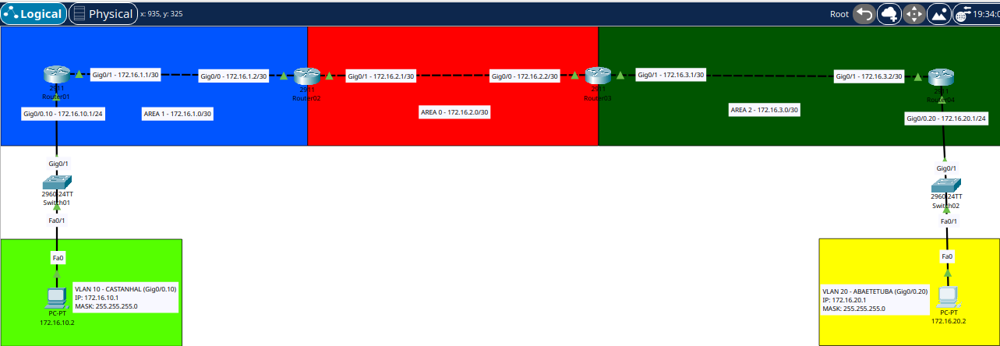

# Lab 09: OSPF Multi-Area Network Between Two Simulated Sites



## Overview

This lab simulates a small company with two different sites in the state of Pará, Brazil: Castanhal and Abaetetuba. Each site has its own router, switch, VLAN and PC representing the local user network. The sites are connected through four routers using OSPF in a multi-area design.

The topology was intentionally built as a straight line:

`PC -- Switch -- R1 -- R2 -- R3 -- R4 -- Switch -- PC`

Unlike a single-area OSPF design, this lab separates the network into three OSPF areas. Castanhal is placed in Area 1, the R2 to R3 backbone link uses Area 0, and Abaetetuba is placed in Area 2. R2 and R3 act as Area Border Routers (ABRs), connecting the non-backbone areas to Area 0.

The main goal of this lab was to understand how OSPF behaves when routes have to cross area boundaries, especially the difference between `O` (OSPF intra-area) and `O IA` (OSPF inter-area) routes.

The lab also covered:

- VLAN creation and access/trunk configuration on Cisco switches
- Router on a Stick using 802.1Q subinterfaces
- DHCP pool configuration per site
- OSPF multi-area configuration
- OSPF router IDs
- OSPF `passive-interface` on LAN facing subinterfaces
- ABRs and the OSPF backbone Area 0
- Verifying OSPF neighbor adjacency
- Reading the routing table and identifying `O` versus `O IA`
- Troubleshooting IOS configuration errors

## Topology

The network is divided into three OSPF areas.

- Area 1 contains R1 and the Castanhal LAN.
- Area 0 is the OSPF backbone between R2 and R3.
- Area 2 contains R4 and the Abaetetuba LAN.
- R2 connects Area 1 to Area 0 and operates as an ABR.
- R3 connects Area 0 to Area 2 and operates as an ABR.

The physical topology is a straight line with no multiaccess segment between multiple routers. Each point to point connection contains only two routers.

### Castanhal Site

The Castanhal LAN uses VLAN 10 and is connected to R1 through a trunk link. R1 uses the `GigabitEthernet0/0.10` subinterface as the default gateway and DHCP server for the LAN.

### Abaetetuba Site

The Abaetetuba LAN uses VLAN 20 and is connected to R4 through a trunk link. R4 uses the `GigabitEthernet0/0.20` subinterface as the default gateway and DHCP server for the LAN.

### OSPF Area Layout

```text
                    AREA 1                 AREA 0                 AREA 2

PC -- Switch -- R1 -------- R2 -------- R3 -------- R4 -- Switch -- PC
                |            |            |            |
           172.16.1.0/30  172.16.2.0/30  172.16.3.0/30
                              BACKBONE

           Castanhal LAN                                Abaetetuba LAN
           172.16.10.0/24                              172.16.20.0/24

                         ABR        ABR
```

## IP Addressing Table

### LAN networks (VLANs)

| Site | VLAN | Name | Network | Gateway |
|------|------|------|---------|---------|
| Castanhal | 10 | CASTANHAL | 172.16.10.0/24 | 172.16.10.1 |
| Abaetetuba | 20 | ABAETETUBA | 172.16.20.0/24 | 172.16.20.1 |

### Point to point links between routers (/30)

| Link | Area | Network | Router A | Router B |
|------|------|---------|----------|----------|
| R1 to R2 | Area 1 | 172.16.1.0/30 | R1 Gi0/1 .1 | R2 Gi0/0 .2 |
| R2 to R3 | Area 0 | 172.16.2.0/30 | R2 Gi0/1 .1 | R3 Gi0/0 .2 |
| R3 to R4 | Area 2 | 172.16.3.0/30 | R3 Gi0/1 .1 | R4 Gi0/1 .2 |

### Interface addressing

| Router | Interface | IP Address | Area | Purpose |
|--------|-----------|------------|------|---------|
| R1 | Gi0/0.10 | 172.16.10.1/24 | Area 1 | Castanhal VLAN gateway |
| R1 | Gi0/1 | 172.16.1.1/30 | Area 1 | R1 to R2 |
| R2 | Gi0/0 | 172.16.1.2/30 | Area 1 | R2 to R1 |
| R2 | Gi0/1 | 172.16.2.1/30 | Area 0 | R2 to R3 |
| R3 | Gi0/0 | 172.16.2.2/30 | Area 0 | R3 to R2 |
| R3 | Gi0/1 | 172.16.3.1/30 | Area 2 | R3 to R4 |
| R4 | Gi0/1 | 172.16.3.2/30 | Area 2 | R4 to R3 |
| R4 | Gi0/0.20 | 172.16.20.1/24 | Area 2 | Abaetetuba VLAN gateway |

### PC addressing

| PC | IP Address | Default Gateway |
|----|------------|-----------------|
| PC Castanhal | 172.16.10.2 | 172.16.10.1 |
| PC Abaetetuba | 172.16.20.2 | 172.16.20.1 |

## OSPF Area Design

The OSPF design uses process ID `1` on all four routers.

| Router | Router ID | Area 1 | Area 0 | Area 2 | Role |
|--------|-----------|--------|--------|--------|------|
| R1 | 1.1.1.1 | Yes | No | No | Internal router |
| R2 | 2.2.2.2 | Yes | Yes | No | ABR |
| R3 | 3.3.3.3 | No | Yes | Yes | ABR |
| R4 | 4.4.4.4 | No | No | Yes | Internal router |

The important design principle is that Area 0 provides the backbone between Area 1 and Area 2. R2 and R3 are ABRs because each has interfaces participating in Area 0 and another OSPF area.

## Device Configuration

All routers used in this lab are Cisco 2911 routers and the switches are Cisco 2960-24TT switches.

### Switch01, Castanhal

```text
Switch>enable
Switch#conf t
Switch(config)#vlan 10
Switch(config-vlan)#name CASTANHAL
Switch(config-vlan)#exit
Switch(config)#interface fa0/1
Switch(config-if)#switchport mode access
Switch(config-if)#switchport access vlan 10
Switch(config-if)#exit
Switch(config)#interface gig0/1
Switch(config-if)#switchport mode trunk
Switch(config-if)#exit
```

### Router01, Castanhal

```text
Router>enable
Router#conf t
Router(config)#interface gig0/0
Router(config-if)#no shutdown
Router(config-if)#exit
Router(config)#interface gig0/0.10
Router(config-subif)#encapsulation dot1Q 10
Router(config-subif)#ip address 172.16.10.1 255.255.255.0
Router(config-subif)#exit
Router(config)#ip dhcp excluded-address 172.16.10.1
Router(config)#ip dhcp pool POOL_CASTANHAL
Router(dhcp-config)#network 172.16.10.0 255.255.255.0
Router(dhcp-config)#default-router 172.16.10.1
Router(dhcp-config)#exit
Router(config)#interface gig0/1
Router(config-if)#ip address 172.16.1.1 255.255.255.252
Router(config-if)#no shutdown
Router(config-if)#exit
```

### Router02, ABR

```text
Router>enable
Router#conf t
Router(config)#interface gig0/0
Router(config-if)#ip address 172.16.1.2 255.255.255.252
Router(config-if)#no shutdown
Router(config-if)#exit
Router(config)#interface gig0/1
Router(config-if)#ip address 172.16.2.1 255.255.255.252
Router(config-if)#no shutdown
Router(config-if)#exit
```

### Router03, ABR

```text
Router>enable
Router#conf t
Router(config)#interface gig0/0
Router(config-if)#ip address 172.16.2.2 255.255.255.252
Router(config-if)#no shutdown
Router(config-if)#exit
Router(config)#interface gig0/1
Router(config-if)#ip address 172.16.3.1 255.255.255.252
Router(config-if)#no shutdown
Router(config-if)#exit
```

### Switch02, Abaetetuba

```text
Switch>enable
Switch#conf t
Switch(config)#interface gig0/1
Switch(config-if)#switchport mode trunk
Switch(config-if)#exit
Switch(config)#interface fa0/1
Switch(config-if)#switchport mode access
Switch(config-if)#switchport access vlan 20
Switch(config-if)#exit
Switch(config)#vlan 20
Switch(config-vlan)#name ABAETETUBA
Switch(config-vlan)#exit
```

### Router04, Abaetetuba

```text
Router>enable
Router#configure terminal
Router(config)#interface GigabitEthernet0/0
Router(config-if)#no shutdown
Router(config-if)#exit
Router(config)#interface gigabitEthernet0/0.20
Router(config-subif)#encapsulation dot1Q 20
Router(config-subif)#ip address 172.16.20.1 255.255.255.0
Router(config-subif)#exit
Router(config)#ip dhcp excluded-address 172.16.20.1
Router(config)#ip dhcp pool POOL_ABAETETUBA
Router(dhcp-config)#network 172.16.20.0 255.255.255.0
Router(dhcp-config)#default-router 172.16.20.1
Router(dhcp-config)#exit
Router(config)#interface gig0/1
Router(config-if)#ip address 172.16.3.2 255.255.255.252
Router(config-if)#no shutdown
Router(config-if)#exit
```

## OSPF Configuration

### Router01, Castanhal

R1 belongs entirely to Area 1. The Castanhal LAN is advertised into Area 1, and the R1 to R2 point to point link is also placed in Area 1. The LAN interface is passive because there is no OSPF speaking neighbor on the user VLAN.

```text
Router(config)#router ospf 1
Router(config-router)#router-id 1.1.1.1
Router(config-router)#network 172.16.10.0 0.0.0.255 area 1
Router(config-router)#network 172.16.1.0 0.0.0.3 area 1
Router(config-router)#passive-interface gig0/0.10
```

### Router02, ABR

R2 participates in both Area 1 and Area 0. This makes R2 the ABR between the Castanhal area and the OSPF backbone.

```text
Router(config)#router ospf 1
Router(config-router)#router-id 2.2.2.2
Router(config-router)#network 172.16.1.0 0.0.0.3 area 1
Router(config-router)#network 172.16.2.0 0.0.0.3 area 0
```

### Router03, ABR

R3 participates in Area 0 and Area 2. This makes R3 the ABR between the OSPF backbone and the Abaetetuba area.

```text
Router(config)#router ospf 1
Router(config-router)#router-id 3.3.3.3
Router(config-router)#network 172.16.2.0 0.0.0.3 area 0
Router(config-router)#network 172.16.3.0 0.0.0.3 area 2
```

### Router04, Abaetetuba

R4 belongs entirely to Area 2. The Abaetetuba LAN and the R3 to R4 point to point link are advertised in Area 2. The LAN interface is passive because there is no OSPF speaking neighbor on the user VLAN.

```text
Router(config)#router ospf 1
Router(config-router)#router-id 4.4.4.4
Router(config-router)#network 172.16.20.0 0.0.0.255 area 2
Router(config-router)#network 172.16.3.0 0.0.0.3 area 2
Router(config-router)#passive-interface gig0/0.20
```

## Verification

### show ip ospf neighbor

The final neighbor output shows that the OSPF adjacencies reached `FULL` state across all three point to point links.

R1 has one neighbor, R2:

```text
Router#show ip ospf neighbor
Neighbor ID     Pri   State           Dead Time   Address         Interface
2.2.2.2           1   FULL/BDR        00:00:38    172.16.1.2
                                                            GigabitEthernet0/1
```

R2 has two neighbors, R1 and R3:

```text
Router#show ip ospf neighbor
Neighbor ID     Pri   State           Dead Time   Address         Interface
1.1.1.1           1   FULL/DR         00:00:33    172.16.1.1
                                                            GigabitEthernet0/0
3.3.3.3           1   FULL/BDR        00:00:35    172.16.2.2
                                                            GigabitEthernet0/1
```

R3 has two neighbors, R2 and R4:

```text
Router#show ip ospf neighbor
Neighbor ID     Pri   State           Dead Time   Address         Interface
2.2.2.2           1   FULL/DR         00:00:34    172.16.2.1
                                                            GigabitEthernet0/0
4.4.4.4           1   FULL/BDR        00:00:36    172.16.3.2
                                                            GigabitEthernet0/1
```

R4 has one neighbor, R3:

```text
Router#show ip ospf neighbor
Neighbor ID     Pri   State           Dead Time   Address         Interface
3.3.3.3           1   FULL/DR         00:00:31    172.16.3.1
                                                            GigabitEthernet0/1
```

The adjacency pattern matches the physical topology: R1 and R4 have one OSPF neighbor each, while R2 and R3 have two.

### show ip ospf interface

The interface verification confirms the intended area assignments.

On R1, the LAN subinterface is in Area 1 and is passive:

```text
GigabitEthernet0/0.10 is up, line protocol is up
Internet address is 172.16.10.1/24, Area 1
Process ID 1, Router ID 1.1.1.1, Network Type BROADCAST, Cost: 1
No Hellos (Passive interface)
Neighbor Count is 0, Adjacent neighbor count is 0
```

The R1 to R2 link is also in Area 1:

```text
GigabitEthernet0/1 is up, line protocol is up
Internet address is 172.16.1.1/30, Area 1
Process ID 1, Router ID 1.1.1.1, Network Type BROADCAST, Cost: 1
State DR
Designated Router (ID) 1.1.1.1
Backup Designated Router (ID) 2.2.2.2
Neighbor Count is 1, Adjacent neighbor count is 1
```

On R2, the two interfaces belong to different areas, confirming its ABR role:

```text
GigabitEthernet0/0 is up, line protocol is up
Internet address is 172.16.1.2/30, Area 1
...
GigabitEthernet0/1 is up, line protocol is up
Internet address is 172.16.2.1/30, Area 0
```

On R3, the interfaces similarly connect Area 0 and Area 2:

```text
GigabitEthernet0/0 is up, line protocol is up
Internet address is 172.16.2.2/30, Area 0
...
GigabitEthernet0/1 is up, line protocol is up
Internet address is 172.16.3.1/30, Area 2
```

On R4, the LAN subinterface is passive in Area 2:

```text
GigabitEthernet0/0.20 is up, line protocol is up
Internet address is 172.16.20.1/24, Area 2
Process ID 1, Router ID 4.4.4.4, Network Type BROADCAST, Cost: 1
No Hellos (Passive interface)
Neighbor Count is 0, Adjacent neighbor count is 0
```

### show ip route

The routing tables provide the clearest demonstration of the difference between OSPF intra-area and inter-area routes.

#### Router01

R1 is inside Area 1. Its directly connected Castanhal LAN is not an OSPF route, while networks learned from other areas appear as `O IA`:

```text
C       172.16.1.0/30 is directly connected, GigabitEthernet0/1
O IA    172.16.2.0/30 [110/2] via 172.16.1.2, GigabitEthernet0/1
O IA    172.16.3.0/30 [110/3] via 172.16.1.2, GigabitEthernet0/1
C       172.16.10.0/24 is directly connected, GigabitEthernet0/0.10
O IA    172.16.20.0/24 [110/4] via 172.16.1.2, GigabitEthernet0/1
```

The important observation is that R1 does not show the remote networks as plain `O`. They are `O IA` because those destinations belong to areas different from Area 1.

#### Router02

R2 is an ABR between Area 1 and Area 0. Its routing table contains an intra-area OSPF route to the Castanhal LAN and inter-area routes toward Area 2:

```text
C       172.16.1.0/30 is directly connected, GigabitEthernet0/0
C       172.16.2.0/30 is directly connected, GigabitEthernet0/1
O IA    172.16.3.0/30 [110/2] via 172.16.2.2, GigabitEthernet0/1
O       172.16.10.0/24 [110/2] via 172.16.1.1, GigabitEthernet0/0
O IA    172.16.20.0/24 [110/3] via 172.16.2.2, GigabitEthernet0/1
```

The `O` route to `172.16.10.0/24` is intra-area because R2's interface toward that network belongs to Area 1.

The `O IA` route to `172.16.20.0/24` is inter-area because the destination is in Area 2.

#### Router03

R3 is an ABR between Area 0 and Area 2:

```text
O IA    172.16.1.0/30 [110/2] via 172.16.2.1, GigabitEthernet0/0
C       172.16.2.0/30 is directly connected, GigabitEthernet0/0
C       172.16.3.0/30 is directly connected, GigabitEthernet0/1
O IA    172.16.10.0/24 [110/3] via 172.16.2.1, GigabitEthernet0/0
O       172.16.20.0/24 [110/2] via 172.16.3.2, GigabitEthernet0/1
```

The `O` route to `172.16.20.0/24` is intra-area because R3's interface toward R4 belongs to Area 2.

The `O IA` route to `172.16.10.0/24` is inter-area because the destination is in Area 1.

#### Router04

R4 is entirely inside Area 2. The Castanhal network is therefore an inter-area route from R4's perspective:

```text
O IA    172.16.1.0/30 [110/3] via 172.16.3.1, GigabitEthernet0/1
O IA    172.16.2.0/30 [110/2] via 172.16.3.1, GigabitEthernet0/1
C       172.16.3.0/30 is directly connected, GigabitEthernet0/1
O IA    172.16.10.0/24 [110/4] via 172.16.3.1, GigabitEthernet0/1
C       172.16.20.0/24 is directly connected, GigabitEthernet0/0.20
```

### Understanding O vs O IA

The most important concept in this lab is the distinction between `O` and `O IA`.

`O` means **OSPF intra-area**. The destination network belongs to the same OSPF area as the router's relevant OSPF domain.

`O IA` means **OSPF inter-area**. The destination network belongs to a different OSPF area and the route has crossed an area boundary through an ABR.

In this topology:

```text
Area 1                         Area 0                         Area 2

R1 -------- R2 --------------- R3 -------- R4
             ABR             ABR

172.16.10.0/24                                      172.16.20.0/24
```

From R1's perspective:

```text
172.16.10.0/24  -> directly connected
172.16.20.0/24  -> O IA
```

From R4's perspective:

```text
172.16.20.0/24  -> directly connected
172.16.10.0/24  -> O IA
```

From R2's perspective, the Castanhal LAN is in its local Area 1, so it appears as `O`, while the Abaetetuba LAN is in Area 2 and appears as `O IA`.

From R3's perspective, the Abaetetuba LAN is in its local Area 2, so it appears as `O`, while the Castanhal LAN is in Area 1 and appears as `O IA`.

This is exactly what the multi-area design is intended to demonstrate.

## Errors Found and Corrections

Documenting the configuration mistakes made during the lab and how they were handled is part of the learning process.

### 1. Incomplete encapsulation command on Router01

While configuring the Castanhal subinterface, the command was initially entered without the required parameters:

```text
Router(config-subif)#encapsulation
% Incomplete command.
```

The command was then completed correctly:

```text
Router(config-subif)#encapsulation dot1Q 10
```

The error was caused by entering an incomplete IOS command rather than a network design problem.

### 2. Incorrect OSPF network command on Router01

The first OSPF configuration attempt on R1 contained an invalid wildcard mask:

```text
Router(config-router)#network 172.16.10.0 0.0.0.0.255 area 1
```

The OSPF process was then entered again and the correct wildcard mask was configured:

```text
Router(config)#router ospf 1
Router(config-router)#router-id 1.1.1.1
Router(config-router)#network 172.16.10.0 0.0.0.255 area 1
Router(config-router)#network 172.16.1.0 0.0.0.3 area 1
Router(config-router)#passive-interface gig0/0.10
```

### 3. OSPF neighbor adjacency messages appearing during configuration

While configuring R2 and R3, OSPF adjacency messages appeared directly in the CLI while a `network` command was being entered. For example:

```text
Router(config-router)#network 172.16.1
00:05:47: %OSPF-5-ADJCHG: Process 1, Nbr 1.1.1.1 on GigabitEthernet0/0 from LOADING to FULL, Loading Done
```

Packet Tracer then displayed an invalid input marker because the command was interrupted by the asynchronous OSPF message.

The important point is that the `%OSPF-5-ADJCHG` message itself was not an OSPF failure. It indicated that the neighbor relationship had successfully reached `FULL`. The configuration was continued with the correct network statement:

```text
Router(config-router)#network 172.16.2.0 0.0.0.3 area 0
```

The same type of asynchronous adjacency message appeared during R3 configuration, followed by the correct Area 2 network statement.

## Final OSPF Validation

The final state confirmed the intended multi-area design.

- R1 formed a `FULL` adjacency with R2.
- R2 formed `FULL` adjacencies with R1 and R3.
- R3 formed `FULL` adjacencies with R2 and R4.
- R4 formed a `FULL` adjacency with R3.
- R1's LAN interface was passive in Area 1.
- R4's LAN interface was passive in Area 2.
- R2 had interfaces in Area 1 and Area 0, confirming its ABR role.
- R3 had interfaces in Area 0 and Area 2, confirming its ABR role.
- Remote networks appeared as `O IA` where expected.
- Networks belonging to the local OSPF area appeared as `O` where expected.

## Key Takeaways

- OSPF multi-area designs divide a routing domain into multiple areas connected through the Area 0 backbone.
- An ABR connects Area 0 to another OSPF area. In this lab, R2 connects Area 1 to Area 0 and R3 connects Area 0 to Area 2.
- `O` identifies an OSPF intra-area route, while `O IA` identifies an OSPF inter-area route.
- The same network can appear as `O` on one router and `O IA` on another depending on the area where each router resides.
- Area 0 is the backbone that allows Area 1 and Area 2 to exchange routing information.
- `passive-interface` prevents OSPF Hello packets from being sent toward end devices while still allowing the connected network to be advertised by OSPF.
- A `FULL` OSPF adjacency confirms that the routers successfully exchanged the required OSPF information with their neighbors.
- IOS can display asynchronous OSPF adjacency messages while a command is being entered. These messages can make the command line look confusing, but the adjacency message itself may indicate successful convergence rather than an error.
- Troubleshooting OSPF requires checking both the routing protocol and the underlying interface, addressing and VLAN configuration.
