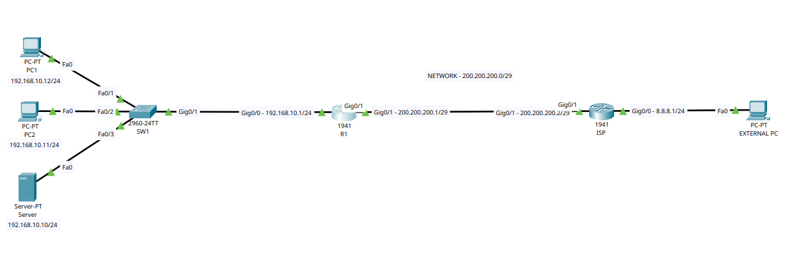

# Lab 10 — Network Address Translation (NAT)



## Overview

This laboratory explores **Network Address Translation (NAT)** in Cisco IOS using a simulated private network connected to an ISP.

The objective is to understand and configure the three main NAT approaches:

- **Static NAT** — permanent one-to-one translation;
- **Dynamic NAT** — temporary translation using a public IP pool;
- **PAT / NAT Overload** — multiple private hosts sharing one public IP address by using different Layer 4 port numbers.

The topology contains an internal LAN with two client PCs and one server, an edge router responsible for NAT, an ISP router, and an external host representing a device on the Internet.

---

## Objectives

By the end of this lab, the following concepts and skills are practiced:

- Understand why NAT is used between private and public networks;
- Identify **inside** and **outside** NAT interfaces;
- Understand **Inside Local** and **Inside Global** addresses;
- Configure and verify **Static NAT**;
- Configure and verify **Dynamic NAT** using a public address pool;
- Configure and verify **PAT / NAT Overload**;
- Use Access Control Lists to identify addresses that must be translated;
- Configure a default route toward the ISP;
- Test connectivity from the private LAN to the simulated Internet;
- Test access from an external host to an internal server through Static NAT;
- Inspect active translations with Cisco IOS verification commands;
- Troubleshoot NAT configuration problems.

---

## Scenario

A small organization uses the private network `192.168.10.0/24` for its internal LAN.

Because private IPv4 addresses are not globally routable on the Internet, the edge router **R1** translates internal addresses before forwarding traffic toward the ISP.

The connection between R1 and the ISP uses the public network:

```text
200.200.200.0/29
```

The ISP also connects to a simulated external network:

```text
8.8.8.0/24
```

Three different NAT scenarios are tested:

1. The internal server receives a permanent public address using **Static NAT**.
2. Internal hosts temporarily receive public addresses from a pool using **Dynamic NAT**.
3. PC1 and PC2 share the public IP address of R1 using **PAT / NAT Overload**.

---

## Topology

```text
                         INTERNAL LAN
                       192.168.10.0/24

          PC1                PC2               Server
   192.168.10.12/24   192.168.10.11/24   192.168.10.10/24
           |                  |                  |
           +------------------+------------------+
                              |
                             SW1
                              |
                              |
                     G0/0 192.168.10.1/24
                         +----------+
                         |    R1    |
                         |   NAT    |
                         +----------+
                     G0/1 200.200.200.1/29
                              |
                              |
                       200.200.200.0/29
                              |
                     G0/1 200.200.200.2/29
                         +----------+
                         |   ISP    |
                         +----------+
                     G0/0 8.8.8.1/24
                              |
                              |
                          8.8.8.0/24
                              |
                         External PC
```

---

## Devices

| Device | Role |
|---|---|
| **R1** | Edge router responsible for NAT |
| **ISP** | Router simulating the Internet Service Provider |
| **SW1** | Layer 2 switch for the internal LAN |
| **PC1** | Internal client |
| **PC2** | Internal client |
| **Server** | Internal server used to test Static NAT |
| **External PC** | Host representing a device on the Internet |

---

## Addressing Table

### Internal LAN

| Device | Interface | IP Address | Subnet Mask | Default Gateway |
|---|---|---:|---:|---:|
| R1 | G0/0 | `192.168.10.1` | `255.255.255.0` | — |
| Server | Fa0 | `192.168.10.10` | `255.255.255.0` | `192.168.10.1` |
| PC2 | Fa0 | `192.168.10.11` | `255.255.255.0` | `192.168.10.1` |
| PC1 | Fa0 | `192.168.10.12` | `255.255.255.0` | `192.168.10.1` |

### R1 ↔ ISP Public Network

| Device | Interface | IP Address | Subnet Mask |
|---|---|---:|---:|
| R1 | G0/1 | `200.200.200.1` | `255.255.255.248` |
| ISP | G0/1 | `200.200.200.2` | `255.255.255.248` |

Network:

```text
200.200.200.0/29
```

Available addresses in this subnet:

```text
Network:     200.200.200.0
R1:          200.200.200.1
ISP:         200.200.200.2
Static NAT:  200.200.200.3
Dynamic NAT: 200.200.200.4 - 200.200.200.6
Broadcast:   200.200.200.7
```

### External Network

| Device | Interface | IP Address | Subnet Mask |
|---|---|---:|---:|
| ISP | G0/0 | `8.8.8.1` | `255.255.255.0` |
| External PC | Fa0 | `8.8.8.2` | `255.255.255.0` |

Default gateway of the External PC:

```text
8.8.8.1
```

---

# NAT Fundamentals

## What is NAT?

**Network Address Translation (NAT)** translates IP addresses as packets move between different networks.

A common use is translating private IPv4 addresses into public IPv4 addresses before traffic is forwarded toward the Internet.

Example:

```text
Inside host
192.168.10.12
      |
      | NAT
      v
Public address
200.200.200.1
```

The internal host continues using its private address. The translation occurs on the edge router.

---

## NAT Inside and Outside

Cisco IOS must know which interface belongs to the private network and which interface belongs to the public network.

In this lab:

```text
R1 G0/0 -> NAT Inside
R1 G0/1 -> NAT Outside
```

Configuration:

```cisco
interface GigabitEthernet0/0
 ip nat inside

interface GigabitEthernet0/1
 ip nat outside
```

---

## NAT Terminology

Two important terms observed in this lab are:

| Term | Meaning | Example |
|---|---|---|
| **Inside Local** | Real private address of an internal host | `192.168.10.12` |
| **Inside Global** | Public address representing that host externally | `200.200.200.1` |

For Static NAT, for example:

```text
Inside Local:  192.168.10.10
Inside Global: 200.200.200.3
```

---

# Base Network Configuration

Before configuring NAT, basic Layer 3 connectivity must exist.

## R1

```cisco
R1> enable
R1# configure terminal

R1(config)# interface GigabitEthernet0/0
R1(config-if)# ip address 192.168.10.1 255.255.255.0
R1(config-if)# no shutdown
R1(config-if)# exit

R1(config)# interface GigabitEthernet0/1
R1(config-if)# ip address 200.200.200.1 255.255.255.248
R1(config-if)# no shutdown
R1(config-if)# exit
```

Configure NAT roles on the interfaces:

```cisco
R1(config)# interface GigabitEthernet0/0
R1(config-if)# ip nat inside
R1(config-if)# exit

R1(config)# interface GigabitEthernet0/1
R1(config-if)# ip nat outside
R1(config-if)# exit
```

R1 also needs a route toward networks outside the organization.

```cisco
R1(config)# ip route 0.0.0.0 0.0.0.0 200.200.200.2
```

The default route means:

> Any destination that is not already present in R1's routing table should be forwarded to the ISP at `200.200.200.2`.

---

## ISP Router

```cisco
ISP> enable
ISP# configure terminal

ISP(config)# interface GigabitEthernet0/1
ISP(config-if)# ip address 200.200.200.2 255.255.255.248
ISP(config-if)# no shutdown
ISP(config-if)# exit

ISP(config)# interface GigabitEthernet0/0
ISP(config-if)# ip address 8.8.8.1 255.255.255.0
ISP(config-if)# no shutdown
ISP(config-if)# exit
```

The ISP does not need a route to `192.168.10.0/24` for normal outbound NAT operation because the private addresses are translated by R1 before reaching the ISP.

---

# Part 1 — Static NAT

## Concept

Static NAT creates a permanent one-to-one relationship between an inside private address and a public address.

In this lab, the internal server uses:

```text
192.168.10.10
```

It is mapped to:

```text
200.200.200.3
```

Therefore:

```text
192.168.10.10 <------ Static NAT ------> 200.200.200.3
```

This allows an external host to communicate with the internal server by using the server's public address.

---

## Static NAT Configuration

On R1:

```cisco
R1(config)# ip nat inside source static 192.168.10.10 200.200.200.3
```

Meaning:

```text
Inside Local  = 192.168.10.10
Inside Global = 200.200.200.3
```

The mapping is permanent and does not depend on the server initiating traffic first.

---

## Verification

```cisco
R1# show ip nat translations
```

A static entry should appear similar to:

```text
Pro  Inside global      Inside local       Outside local      Outside global
---  200.200.200.3      192.168.10.10      ---                ---
```

---

## Static NAT Test

From the External PC, test the public address:

```text
ping 200.200.200.3
```

Packet flow:

```text
External PC
8.8.8.2
   |
   v
ISP
   |
   v
200.200.200.3
   |
   | R1 performs Static NAT
   v
192.168.10.10
   |
 Server
```

The external host uses only the public address. R1 translates the destination back to the server's private address.

---

# Part 2 — Dynamic NAT

## Concept

Dynamic NAT also performs one-to-one translation, but the public address is not permanently associated with a specific private host.

Instead, the router chooses an available address from a configured public pool.

This lab uses the remaining addresses of the `/29` public subnet as the Dynamic NAT pool:

```text
200.200.200.4
200.200.200.5
200.200.200.6
```

Pool representation:

```text
Internal hosts
      |
      v
+-------------------+
| Dynamic NAT Pool  |
+-------------------+
| 200.200.200.4     |
| 200.200.200.5     |
| 200.200.200.6     |
+-------------------+
```

---

## Step 1 — Identify Inside Addresses

A Standard ACL identifies which private addresses are eligible for translation.

```cisco
R1(config)# access-list 1 permit 192.168.10.0 0.0.0.255
```

Wildcard mask:

```text
255.255.255.0  -> subnet mask
0.0.0.255      -> wildcard mask
```

The ACL does **not** block traffic in this context. It identifies which source addresses may be translated by NAT.

---

## Step 2 — Create the Public NAT Pool

```cisco
R1(config)# ip nat pool NAT-POOL 200.200.200.4 200.200.200.6 netmask 255.255.255.248
```

Pool name:

```text
NAT-POOL
```

Address range:

```text
200.200.200.4 - 200.200.200.6
```

---

## Step 3 — Associate the ACL with the Pool

```cisco
R1(config)# ip nat inside source list 1 pool NAT-POOL
```

Logic:

```text
Source matches ACL 1
        |
        v
Choose free address from NAT-POOL
        |
        v
Translate private -> public
```

---

## Dynamic NAT Test

Generate traffic from an internal PC toward the external host.

From PC1:

```text
ping 8.8.8.2
```

Then verify R1:

```cisco
R1# show ip nat translations
```

An internal address such as:

```text
192.168.10.12
```

should receive an available address from:

```text
200.200.200.4 - 200.200.200.6
```

Unlike Static NAT, this relationship is created dynamically.

---

## Dynamic NAT Limitation

Dynamic NAT requires one available public address for every simultaneous translated host.

With this pool:

```text
200.200.200.4
200.200.200.5
200.200.200.6
```

only three public addresses are available.

If all addresses are in use, another inside host cannot obtain a new Dynamic NAT translation until an address becomes available.

This limitation helps explain why **PAT** is much more common for general Internet access.

---

# Part 3 — PAT / NAT Overload

## Concept

PAT stands for **Port Address Translation** and is commonly called **NAT Overload** in Cisco IOS.

Instead of assigning one public address to each internal host, PAT allows multiple private hosts to share a single public IP address.

In this lab, the public address of R1's outside interface is:

```text
200.200.200.1
```

Both PC1 and PC2 can therefore be represented by the same public address.

```text
PC1 192.168.10.12 ----\
                       \
                        >---- 200.200.200.1
                       /
PC2 192.168.10.11 ----/
```

The router keeps the sessions separate by tracking Layer 4 information such as TCP or UDP port numbers.

Conceptually:

```text
192.168.10.11:port-A -> 200.200.200.1:translated-port-A
192.168.10.12:port-B -> 200.200.200.1:translated-port-B
```

---

## PAT Configuration

The ACL identifies the private addresses that may be translated:

```cisco
R1(config)# access-list 2 permit 192.168.10.0 0.0.0.255
```

PAT then uses the IP address configured on R1's outside interface:

```cisco
R1(config)# ip nat inside source list 2 interface GigabitEthernet0/1 overload
```

The important keyword is:

```text
overload
```

This enables many-to-one translation.

---

## PAT Test

Generate external traffic from both internal PCs.

PC1:

```text
ping 8.8.8.2
```

PC2:

```text
ping 8.8.8.2
```

Then inspect R1:

```cisco
R1# show ip nat translations
```

The important observation is that **both PC1 and PC2 can use the same public IP address `200.200.200.1` simultaneously**.

PAT differentiates their sessions using transport-layer information.

This behavior is the basis of the NAT mechanism commonly used by home and small-office routers.

---

# Testing the Three NAT Types

The lab should be tested in stages so that each NAT mechanism can be observed clearly.

## Test 1 — Static NAT

Goal:

```text
External PC -> 200.200.200.3 -> Server 192.168.10.10
```

Useful commands:

```cisco
show ip nat translations
show ip nat statistics
```

Expected concept:

```text
192.168.10.10 <-> 200.200.200.3
```

---

## Test 2 — Dynamic NAT

Goal:

```text
Internal PC -> Dynamic public address -> External network
```

Generate traffic and check:

```cisco
show ip nat translations
```

Expected concept:

```text
192.168.10.x -> one address from 200.200.200.4 - 200.200.200.6
```

---

## Test 3 — PAT

Goal:

```text
PC1 ----\
         >---- 200.200.200.1 ---- External network
PC2 ----/
```

Generate traffic from both hosts and check:

```cisco
show ip nat translations
```

Expected result:

- PC1 and PC2 communicate externally;
- both are represented by `200.200.200.1`;
- the router maintains separate translation entries.

---

# NAT Verification Commands

## Show Active Translations

```cisco
R1# show ip nat translations
```

This is the primary command used to view current NAT mappings.

Typical fields include:

```text
Pro
Inside global
Inside local
Outside local
Outside global
```

---

## Show NAT Statistics

```cisco
R1# show ip nat statistics
```

This command can display:

- Total active translations;
- NAT inside interfaces;
- NAT outside interfaces;
- Dynamic mappings;
- NAT pools;
- Pool address usage;
- Translation counters.

---

## Check Interface Status

```cisco
R1# show ip interface brief
```

The relevant interfaces should be operational:

```text
GigabitEthernet0/0    up    up
GigabitEthernet0/1    up    up
```

---

## Check Routing

```cisco
R1# show ip route
```

R1 should contain the connected networks and the default route toward the ISP.

Expected routes include:

```text
192.168.10.0/24
200.200.200.0/29
0.0.0.0/0 via 200.200.200.2
```

---

## Clear Dynamic NAT Translations

When changing between Dynamic NAT and PAT tests, existing dynamic translations may need to be cleared.

```cisco
R1# clear ip nat translation *
```

Static translations remain defined in the configuration.

---

## Debug NAT

For troubleshooting:

```cisco
R1# debug ip nat
```

Disable debugging after the test:

```cisco
R1# undebug all
```

> `debug` commands should be used carefully on production equipment because they can generate large amounts of output and consume device resources.

---

# Troubleshooting

## 1. Verify Host IP Configuration

Internal hosts must be in the correct subnet and use R1 as their default gateway.

```text
Network:         192.168.10.0/24
Default Gateway: 192.168.10.1
```

If the default gateway is missing or incorrect, packets destined for external networks will never reach R1.

---

## 2. Verify R1 Interfaces

```cisco
show ip interface brief
```

Both interfaces must be `up/up`.

If necessary:

```cisco
interface GigabitEthernet0/0
 no shutdown

interface GigabitEthernet0/1
 no shutdown
```

---

## 3. Verify NAT Inside / Outside

Check the running configuration:

```cisco
show running-config
```

R1 must contain:

```cisco
interface GigabitEthernet0/0
 ip nat inside

interface GigabitEthernet0/1
 ip nat outside
```

Reversing these roles prevents NAT from working correctly.

---

## 4. Verify the Default Route

```cisco
show ip route
```

R1 must know where to forward unknown destinations.

```cisco
ip route 0.0.0.0 0.0.0.0 200.200.200.2
```

---

## 5. Verify the ACL

For Dynamic NAT or PAT, confirm that the ACL matches the internal addresses.

```cisco
show access-lists
```

Expected network:

```text
192.168.10.0 0.0.0.255
```

Remember that the NAT ACL identifies traffic for translation; it is not being used here as a normal packet-filtering ACL on an interface.

---

## 6. Verify the NAT Pool

```cisco
show ip nat statistics
```

For Dynamic NAT, verify the pool:

```text
NAT-POOL
200.200.200.4 - 200.200.200.6
```

---

## 7. Generate Traffic Before Checking Dynamic Entries

Dynamic NAT and PAT translations are normally created when traffic passes through the router.

If:

```cisco
show ip nat translations
```

shows no dynamic entries, first generate traffic from an internal PC toward the external network.

---

## 8. Clear Old Translations Between Tests

Old dynamic entries may remain temporarily and make verification confusing.

Use:

```cisco
clear ip nat translation *
```

Then generate new traffic and check the translation table again.

---

# Comparison: Static NAT vs Dynamic NAT vs PAT

| Characteristic | Static NAT | Dynamic NAT | PAT / Overload |
|---|---|---|---|
| Mapping | 1:1 | 1:1 while active | Many:1 |
| Public address assignment | Permanent | Temporary | Shared |
| Public IP pool required | No | Yes | No, when using interface address |
| Uses ports to separate hosts | No | No | Yes |
| Best use in this lab | Internal server | Demonstrating address pools | Client Internet access |
| Public address efficiency | Low | Medium | High |

---

# Visual Comparison

## Static NAT

```text
192.168.10.10  <---------------->  200.200.200.3
   Server               1:1           Public IP
```

## Dynamic NAT

```text
192.168.10.11 ----\
                    >---- NAT Pool ---- 200.200.200.4
192.168.10.12 ----/                    200.200.200.5
                                      200.200.200.6
```

Each active host consumes one public address from the pool.

## PAT

```text
192.168.10.11 ----\
                    >---- 200.200.200.1
192.168.10.12 ----/

          Same public IP
       Different translations
```

---

# Complete R1 Configuration Reference

The following summarizes the main configuration used throughout the lab.

```cisco
hostname R1

interface GigabitEthernet0/0
 ip address 192.168.10.1 255.255.255.0
 ip nat inside
 no shutdown

interface GigabitEthernet0/1
 ip address 200.200.200.1 255.255.255.248
 ip nat outside
 no shutdown

ip route 0.0.0.0 0.0.0.0 200.200.200.2

! Static NAT
ip nat inside source static 192.168.10.10 200.200.200.3

! Dynamic NAT identification
access-list 1 permit 192.168.10.0 0.0.0.255

! Dynamic NAT pool
ip nat pool NAT-POOL 200.200.200.4 200.200.200.6 netmask 255.255.255.248

! Dynamic NAT mapping
ip nat inside source list 1 pool NAT-POOL

! PAT identification
access-list 2 permit 192.168.10.0 0.0.0.255

! PAT / NAT Overload
ip nat inside source list 2 interface GigabitEthernet0/1 overload
```

> During practical testing, Dynamic NAT and PAT are best observed in separate test stages. Clear previous dynamic translations and enable the NAT method being tested so the resulting translation table is easy to interpret.

---

# Complete ISP Configuration Reference

```cisco
hostname ISP

interface GigabitEthernet0/1
 ip address 200.200.200.2 255.255.255.248
 no shutdown

interface GigabitEthernet0/0
 ip address 8.8.8.1 255.255.255.0
 no shutdown
```

---

# Useful Cisco IOS Commands

| Command | Purpose |
|---|---|
| `show ip interface brief` | Verify interface status and IP addresses |
| `show ip route` | Display the routing table |
| `show running-config` | Review the active configuration |
| `show access-lists` | Verify ACL matches |
| `show ip nat translations` | Display NAT translation entries |
| `show ip nat statistics` | Display NAT statistics and pools |
| `clear ip nat translation *` | Clear dynamic translations |
| `debug ip nat` | Display NAT activity in real time |
| `undebug all` | Disable all debugging |

---

# What Was Learned

This laboratory demonstrated that **NAT is not a single translation method**. Cisco IOS provides different NAT techniques for different network requirements.

### Static NAT

Static NAT creates a permanent relationship:

```text
192.168.10.10 <-> 200.200.200.3
```

This is appropriate for a server that must always be reachable through the same public address.

### Dynamic NAT

Dynamic NAT assigns an available public address from a pool:

```text
192.168.10.x -> 200.200.200.4 - 200.200.200.6
```

The translation is temporary and depends on address availability.

### PAT / NAT Overload

PAT allows multiple private hosts to share one public IP address:

```text
192.168.10.11 ----\
                    >---- 200.200.200.1
192.168.10.12 ----/
```

The successful PAT test demonstrated that **PC1 and PC2 can communicate externally using the same public IP while the router maintains separate translations**.

This is significantly more efficient than assigning a different public IPv4 address to every internal device.

---

# Key Takeaways

- NAT translates addresses between private and public networks.
- R1 acts as the organization's NAT edge router.
- `ip nat inside` identifies the private-facing interface.
- `ip nat outside` identifies the public-facing interface.
- Static NAT provides a permanent **1:1** mapping.
- The server `192.168.10.10` is represented externally as `200.200.200.3`.
- Dynamic NAT obtains public addresses from a configured pool.
- The Dynamic NAT pool uses `200.200.200.4` through `200.200.200.6`.
- Dynamic NAT still requires one public IP for every simultaneous translated host.
- PAT allows multiple internal devices to share a single public IP.
- PC1 and PC2 share `200.200.200.1` during the PAT test.
- The `overload` keyword enables PAT in Cisco IOS.
- Standard ACLs can identify which inside addresses should be translated.
- NAT does not replace routing; R1 still requires a route toward the ISP.
- `show ip nat translations` is the main command for observing translations.
- `show ip nat statistics` is useful for verifying interfaces, pools, counters, and active NAT behavior.
- `clear ip nat translation *` is useful when changing between NAT test scenarios.
- Static NAT is useful for published internal services, while PAT is the most efficient method for normal client Internet access.

---

## Lab Summary

**Lab:** 10 — Network Address Translation (NAT)  
**Platform:** Cisco Packet Tracer  
**Edge Router:** Cisco 1941  
**Main Topics:** Static NAT, Dynamic NAT, PAT / NAT Overload, NAT Pools, ACLs, Inside/Outside interfaces, routing, verification, and troubleshooting.

This lab simulates an organization connected to an ISP and demonstrates how a Cisco router translates private IPv4 addresses into public addresses under different NAT strategies.
